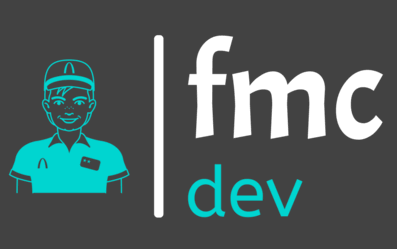
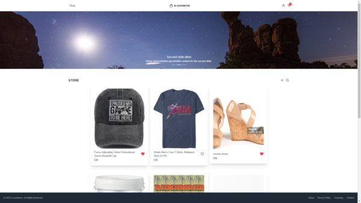
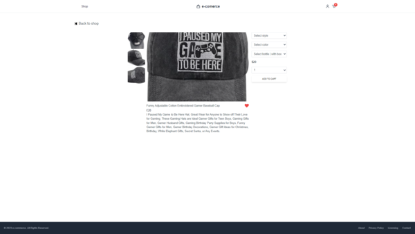
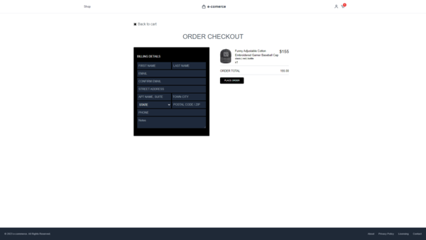
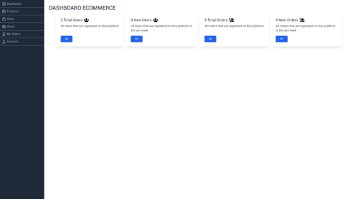
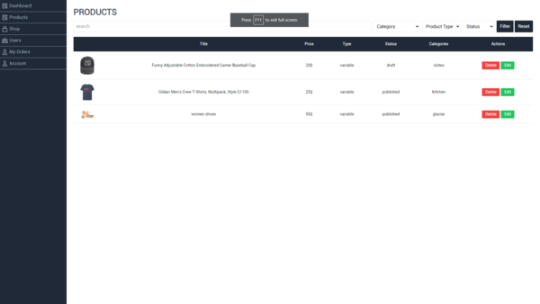
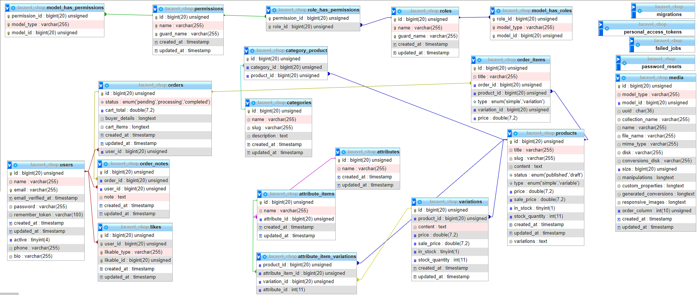

<!-- Improved compatibility of back to top link: See: https://github.com/othneildrew/Best-README-Template/pull/73 -->
<a name="readme-top"></a>
<!--
*** Thanks for checking out the Best-README-Template. If you have a suggestion
*** that would make this better, please fork the repo and create a pull request
*** or simply open an issue with the tag "enhancement".
*** Don't forget to give the project a star!
*** Thanks again! Now go create something AMAZING! :D
-->


<!-- PROJECT LOGO -->
<br />
<div align="center">
  <a href="https://github.com/othneildrew/Best-README-Template">
    
  </a>

</div>


<!-- TABLE OF CONTENTS -->
<details>
  <summary>Table of Contents</summary>
  <ol>
    <li>
      <a href="#about-the-project">About The Project</a>
      <ul>
        <li><a href="#built-with">Built With</a></li>
      </ul>
    </li>
    <li>
      <a href="#getting-started">Getting Started</a>
      <ul>
        <li><a href="#prerequisites">Prerequisites</a></li>
        <li><a href="#installation">Installation</a></li>
      </ul>
    </li>

    
  </ol>
</details>


<!-- ABOUT THE PROJECT -->
## About The Project

Just simple example e commerce for demonstration purposes.
## Front End

<br/>



<br/>



<br/>

## Back End


<br/>







<p align="right">(<a href="#readme-top">back to top</a>)</p>


### Built With

* [![Vue][Vue.js]][Vue-url]
* [![Laravel][Laravel.com]][Laravel-url]


<p align="right">(<a href="#readme-top">back to top</a>)</p>


<!-- GETTING STARTED -->
## Getting Started

This is an example of how you may give instructions on setting up your project locally.
To get a local copy up and running follow these simple example steps.

## Requirements

Package | Version
--- | ---
[Node](https://nodejs.org/en/) | V14.19.1+
[Npm](https://nodejs.org/en/)  | V6.14.16+ 
[Composer](https://getcomposer.org/)  | V2.7.2+
[Php](https://www.php.net/)  | V7.4.6+
[Mysql](https://mariadb.com/)  |V 10.4.11+


### Installation
1. Clone the repository:

```bash
git clone https://github.com/franmadj/laravel_shop.git
```
 ```bash
cd laravel_shop
```

 ```bash
composer install
```
 ```bash
cp .env.example .env
```
```bash
php artisan key:generate
 ```
```bash
php artisan storage:link
```
 ```bash
 php artisan migrate --seed
```
 ```bash
 npm install
```
 ```bash
 npm run prod
```
 ```bash
 php artisan serve
```

<p align="right">(<a href="#readme-top">back to top</a>)</p>


## If you like our project please leave a star ❤


<!-- MARKDOWN LINKS & IMAGES -->
<!-- https://www.markdownguide.org/basic-syntax/#reference-style-links -->

[product-screenshot]: images/screenshot.png
[Vue.js]: https://img.shields.io/badge/Vue.js-35495E?style=for-the-badge&logo=vuedotjs&logoColor=4FC08D
[Vue-url]: https://vuejs.org/
[Laravel.com]: https://img.shields.io/badge/Laravel-FF2D20?style=for-the-badge&logo=laravel&logoColor=white
[Laravel-url]: https://laravel.com
